<c>
HAVE YOU EVER DREAMED?
</c>

# Introduction

This project has its roots in my bachelor thesis, where I analyzed and considered new possible concert forms, based on multisensory and interaction with the public.

The multisensory realization was based on being able to give shape and space to the music that is played. Within a system of particles with mass, thanks to an algorithm, the frequencies played were interpolated to generate a point of attraction for the individual
masses.

Trying to correlate space and sound, this first experiment was the incipit of new intentions and evolutions represented here in this study. If it is possible through an algorithm to position a specific frequency within the three dimensions, what musical possibilities does space hide? Is it possible to make the two sensory dimensions dialogue? Can we create a system that, in real time, allows a narration
based on the interaction of these two sensorialities?

<h3 align="center">
"Darkness is to space what silence is to sound." <p>
- Marshall McLuhan - <p>
from "Toward a Spatial Dialogue".
</h3>

**The method**

The method that is designed for this project works to collect 500 coordinates from a particle system that will be used to control parameters inside the sound domain. In this case the project generate sound thanks to a process of granular synthesis, and the particles will not only guide those parameters but also an effects rack and the panning of each sound. 

An example of such process is shown below, where the two points (red and cyan) are the source of attraction for the system of particles. Note that in the macro view of the particle system the position values are only representative.

<p  align="center">
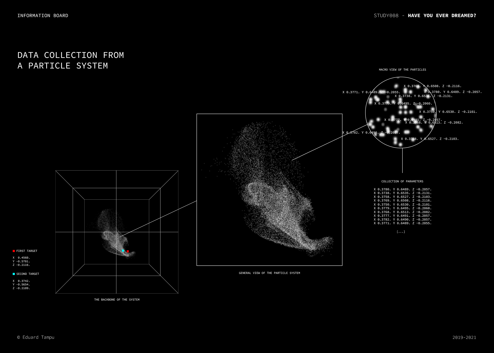
</p>

**Tools**

For the realization of this system is used as main software [Max/MSP](https://cycling74.com/products/max), inside of which the graphics are executed thanks to ```Jitter's``` operators and moreover allows the retrieving of parameters from the particle system. Code portions runs inside ```js``` modules, and the granular synthesis is achieved using the ```mc``` modules. Also, OSC protocol is implemented for the realization of an alternative model for the attraction system inside the particles.

**Important note**. The initial realization of the particle system and the mc granular synthesis are based on [Federico Foderaro's](https://www.federicofoderaro.com/) works, here listed:

- [MC in Max/MSP | Granular Synthesizer](https://www.youtube.com/watch?v=YnROTQAQW_I&t=22s)
- [How to Build a Particle System in Max ](https://www.youtube.com/watch?v=TRgX7rVgSAE&t=1004s)

I want to underlain that those materials had been modified or to which parameterizations or ad-hoc solutions have been implemented.

# Inside the process

This project is the combination of different processes, some of them will not be discussed more than necessary. The macro view contains four blocks, each of which contains micro processes that allows the overall realization of this system.

Here is a list of these four major processes:

1. The generation of two points of attraction.
2. Creation of a particle system.
3. Collection of parameters.
4. Granular synthesis modules.

## Generation of two points of attraction

In order to generate a result, is needed an interaction with the particle system that will be created. This first step is composed by three major possibilities, one the basis of how the whole patch will behave. In fact, depending on this first point, the interaction with the project, the sonification and the end result, can be completely changed. Those possibilities are:

- Two randomized and interpolated coordinates. 
- The use of two motion sensors that communicates via OSC to guide the system.
- The use of a sound signal, with a custom algorithm, that provides a specific point in space from the detected frequency by the system.

#### Two randomized points

This interaction as can be deduced works to generate two coordinates (x, y, z) on a random basis. Those then will be interpolated to create a soft movement from a point to another (the interpolation process is explained [here](coordinate_from_frequency/README.md/#interpolation-of-points)). 

There is no need for further explanation of this process, but in addition below can be seen how it operates:

<p  align="center">
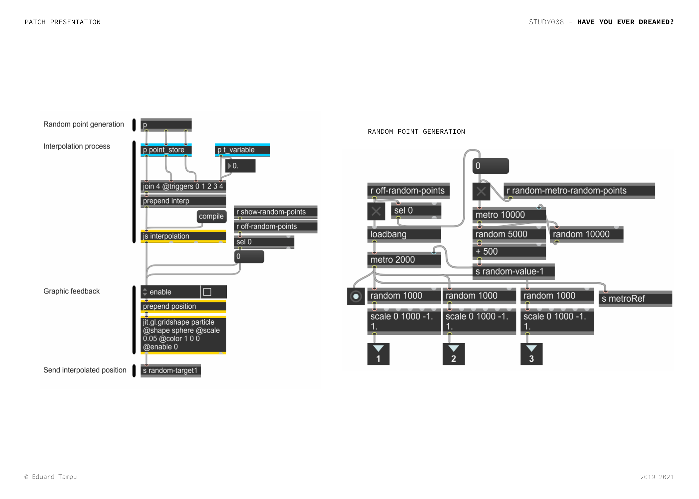
</p>

### OSC motion sensors 

The next method is realized to create a solution of interaction that could be as such as familiar for an user and most important, realizable in every situation. More over, the interaction with the system thanks to the following, realize an approach to a complex sound realization intuitive and extremely interactive, due to the multisensory experience that (1) from a gesture realize a (2) visual stimulus through the particles that as consequence (3) retrieves an immersive auditory sensation. 

Beyond that, as said the need of a system that could be realizable in every situation has it meaning when considered the tools used. Instead of the possible applications via infrared cameras (such as the Kinect® by Microsoft®) or other alternatives that aims the same purpose, for this is used an application on a mobile phone that returns information such as: Acceleration, Attitude, Rotation and Magnetic heading. 

With this said the process to work (1) requires no expenses for tools, (2) can be used everywhere (the OSC information can run via localhost or mobile hotspot) and (3) the interaction with the tool and the program is natural. 

Before further explanation of the realization, is needed to specify that the interaction can be done with any application that returns the information mentioned above. In this case I used [wekiOSC](https://appagg.com/ios/education/wekiosc-30800525.html?hl=en) by Isaac Clarke for iOS (lately the application was removed from the AppStore, alternative to that is [ZIG SIM](https://1-10.github.io/zigsim/getting-started.html#install) by © 1→10, inc. 

Note. In the case of this project are used two devices with the same application, this because one device also parametrize the interaction with the particle system (the control of the force of attraction mainly). But it can be done with one single device or in other various ways. 

The designed method after having stabilized a connection to the device, maps the incoming value to the dimension of the particle system. Is also possible to apply a different mapping value if the dimension of the particle system change or if is intended to use the values for another purpose. 

<p  align="center">
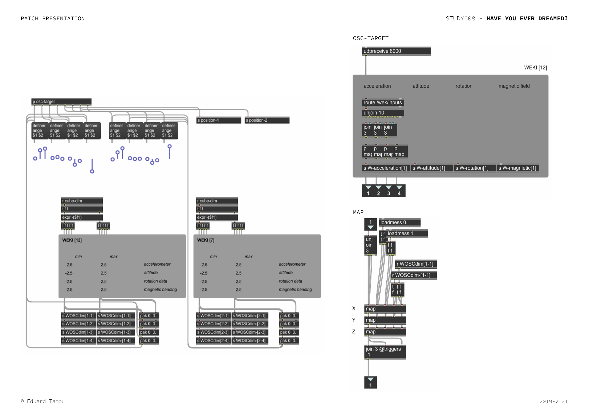
</p>

Can be seen that the ```position-1``` and the ```position-2``` are connected to the acceleration and rotation returned by the second device. But every output potentially can be used to achieve the same result, but with different interactions by the user. 

### Coordinates from sound signal

Before introducing this last method is useful to explain briefly how the granular synthesis operates, because it will help to understand the possibilities of this solution. The sound realization can work on two basis: (1) importing samples to elaborate or (2) recording materials in live. 

Once said this, this approach wants to open an interaction with musician especially. Is realized to create a system that allows a dialogue between the musician and the machine, where the executor plays and interacts with the particle system and in response the system interacts thanks to the granular synthesis with the executor in a dialogue of voices. Where the executor hears the re-elaboration of one recorded sample or can interact with pre-recorded materials (or both).

In the following will be explained the system and how it returns a coordinate, excluding the algorithm that realize the conversion from frequency to (x, y, z) coordinate that is explained [here](coordinate_from_frequency/README.md) and the [interpolation](coordinate_from_frequency/README.md/#interpolation-of-points) of the points, that is a close process of the previous.  

To begin with, is required a input signal from a microphone. After that, for the system to work the signal is analyzed for pitch detection.

Note. In this patch is used the ```retune~``` object, with the specification ```@pitchdetection 1```. Other modules for pitch detection can be used (such as ```sigmund~```) or other methods can be applied. Note also, the pitch detection works for monophonic instruments, but quite interesting results can be achieved (for the purpose of this realization) also using polyphonic instruments but having a non-precise lecture of the frequencies played. 

Parallel to the pitch tracking is the detection of a change in what is played, using ```bonk~``` object that is a detector of attach in an incoming signal. This is used as trigger during future processes, because of the high stream of information that is returned by the pitch tracker and the high disadvantages in using each new value as triggering factor. 

<p  align="center">
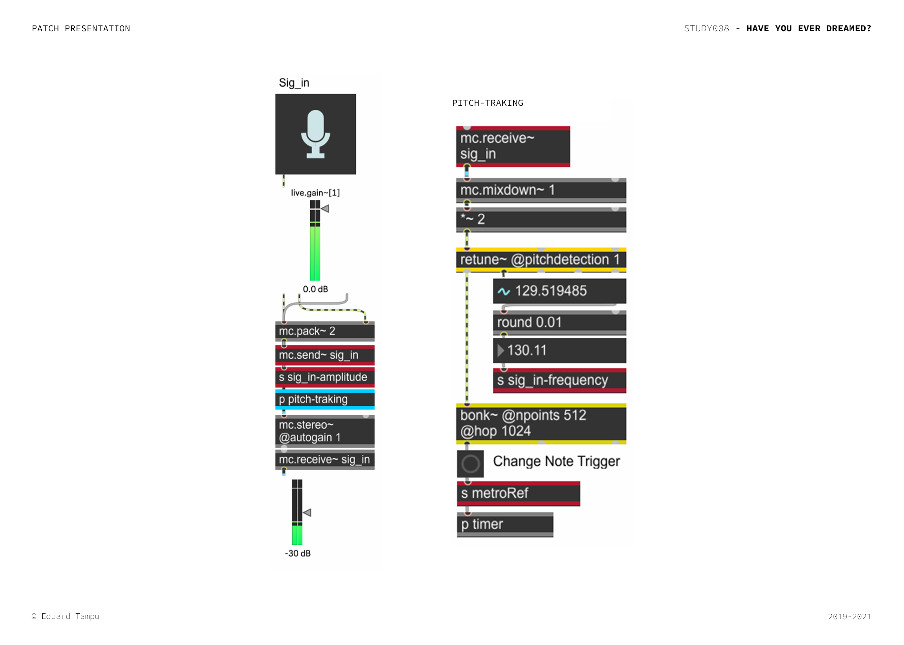
</p>

The process then goes trough the conversion method that, as mentioned is explained [here](coordinate_from_frequency/README.md). The end result is a given interpolated coordinate and in addition, for the purpose of the system, this values are delayed to a factor of choice of the user, generation a second point of attraction inside the system. 

<p  align="center">
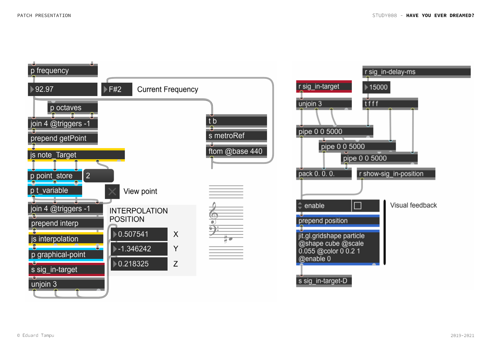
</p>

## Creation of a particle system

The obtained coordinate from one of the mentioned methods, is then applied to the particle system. As specified before, the base of this realization is derived by [Federico Foderaro's work](https://www.youtube.com/watch?v=TRgX7rVgSAE&t=1004s). The method used works with the ```jitter``` series of objects, using also the gen environment to achieve the end result. 
To the original materials of Foderaro is: (1) applied a variation to the use of the forces, (2) an imposition of limits to the travel of particles (with the application of a ```max``` and ```min``` module to the ```jit.gen update``` operator). Is (3) changed the derivation of the points of attraction inside the system and added (3) changed the visual aspect of the particles by adding a second ```jit.gl.mesh```.

The parameters that describes the variables inside the system are mainly controlled by a user interface.

<p  align="center">
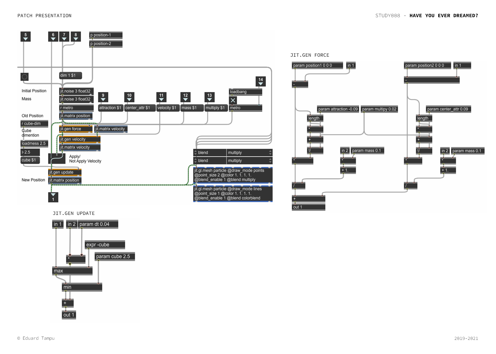
</p>

The returned result is non other then a matrix of vertices, that tells to the operators where a particular element has to be displayed (in this case the operator that cause the actual display is the ```jit.gl.mesh``` operator). The visual result will be something like this:

<p  align="center">
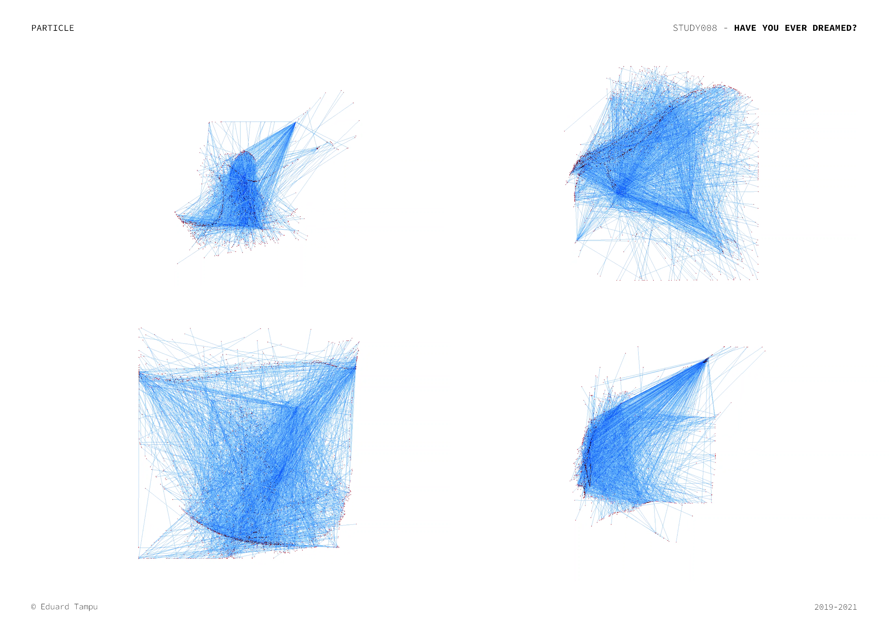
</p>

## Collection of parameters

The visual result is not the only thing that the previous step gives to the process, as said, the matrix that realize the visual stimuli, contains the position of each particle at that moment in time. Reiterated this, to use those values as parameters inside the project, will be needed to split the matrix into three arrays (one for each dimension: x, y, z). This step will collect no more than 500 value for each plane, that means that occurs a resampling of the values. For 1000 particles [1, 2, 3, 4, 5, 6...] the values collected will be the [1, 3, 5...].

Then the values obtained for each plane are split using a ```unjoin``` object. The selection of values to use is on a random basis. With that is meant that, due to the dense numbers of values, there is not a specific way to redirect the values, if not choosing the value based on the membership axis (x, y or z). An example of this is the parametrization of the panning, that is related to the x axes.

<p  align="center">
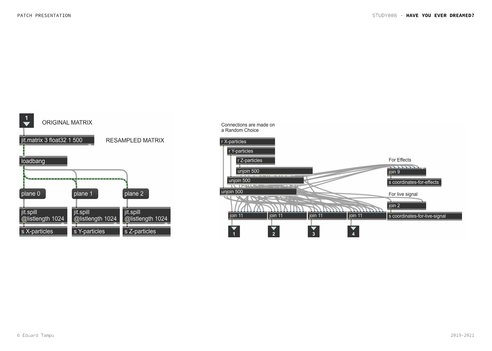
</p>

## Granular synthesis modules

The final step of this process is to generate a sound and use the values obtained with the previous steps to control some of parameters related to it. In this case are used ```mc``` based granular synthesis modules, for which as mentioned is used [Federico Foderaro's](https://www.youtube.com/watch?v=YnROTQAQW_I&t=22s) work as initial approach.

<p  align="center">
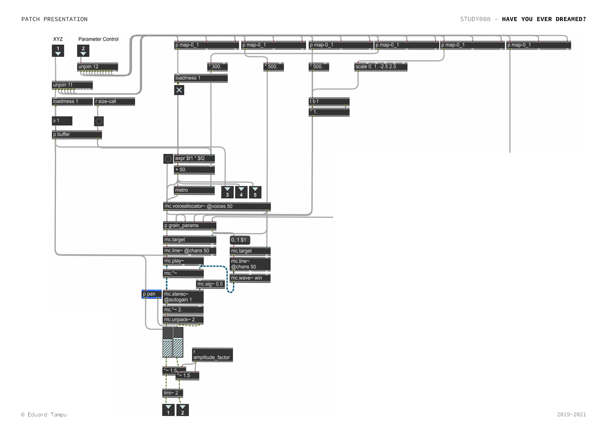
</p>

Here can already be seen that the particles coordinates are used inside this module to control the values of the synthesis. But furthermore, it is not sufficient applying the values to the parameters. 

To achieve a better result in the parametrization is created a mapping system that allows the user to control how and how much the particle position affects that particular parameter. 

Going in order, this is the interface that the user sees and uses (the patch is in edit mode to give more details about the environment):

<p  align="center">
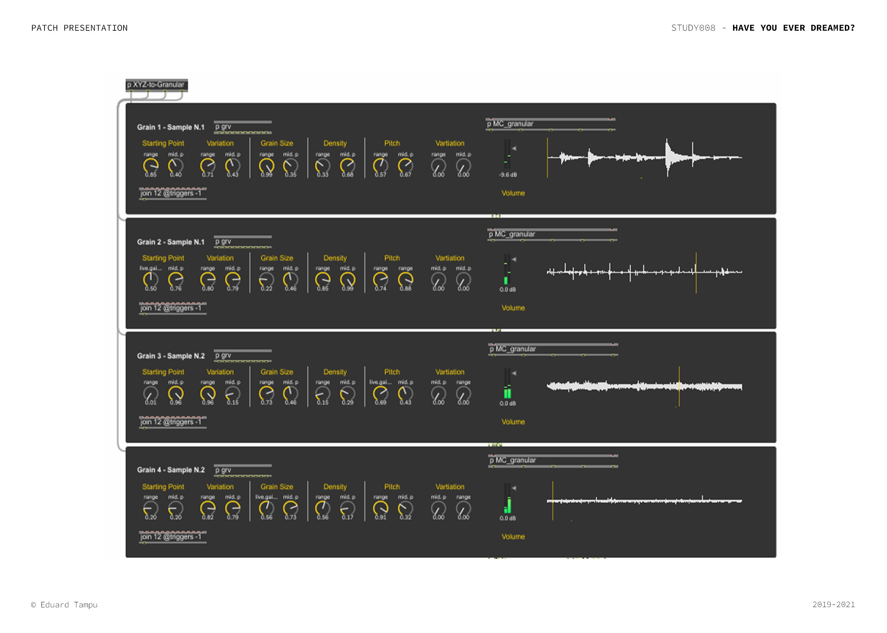
</p>

As can be seen, each parameter has to knobs that indicates a ```mapping range dimension``` (```range```) and a ```midpoint``` (```mid. p```). Those values are then imported inside the ```mc_granular``` sub-patches, shown in the image before. Recalling the last image, those values goes through a  ```map-0_1``` sub-patch, in combination with the particle values:

<p  align="center">
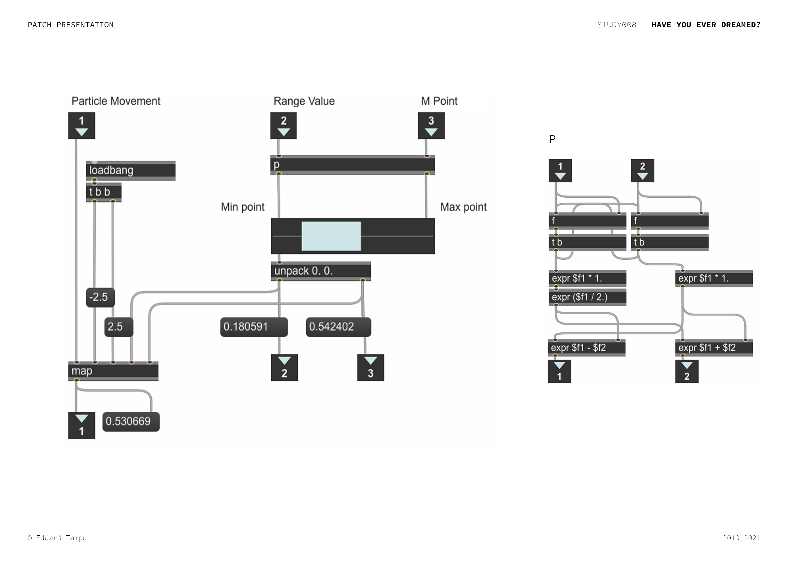
</p>

Inside this sub-patch are operated few, but important things. To begin with, the two values ```mapping range dimension``` and ```midpoint``` are used to create a ```particle mapping range``` with the formula:

```
particle mapping range = PMR[start, finish]

mapping range dimension = MRD
midpoint = MP

PMR[start] = MRD/2 - MP;
PMR[finish] = MRD/2 + MP;

```

This, in other words creates a variable range in which the particle is mapped. Watching the image above can be seen that after this evaluation, the particle movement is linearly interpolated inside the defined range. Below, a representation of the process is shown:

<p  align="center">
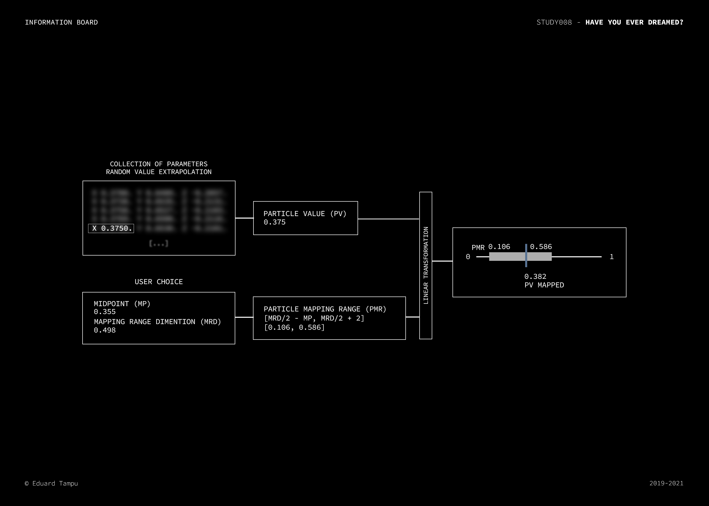
</p>

Once the granular synthesis is realized, controlled by the mapped particles, recalling the first image in this section, can be seen that there is another particle value that is implemented for the pan of the sound. 

As said earlier talking about the random use of the values, it was mentioned that for the panning it was used a value from the x axes. This allows the creation of a dynamic combination of sounds in the end, that follows the movement of the particles from left to right. 

<p  align="center">
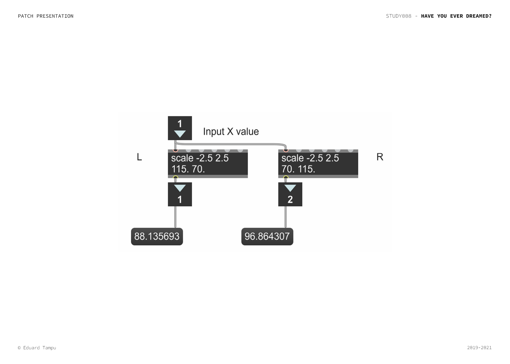
</p>

# Listenings 

You can find two realisation of this project with two different approaches, to the following links: 
  - [OSC motion sensors (data visualization)](https://youtu.be/ar-U1BCVSf8)
  - [Signal input as method of interaction](https://youtu.be/N5PPy4o6T1I)
