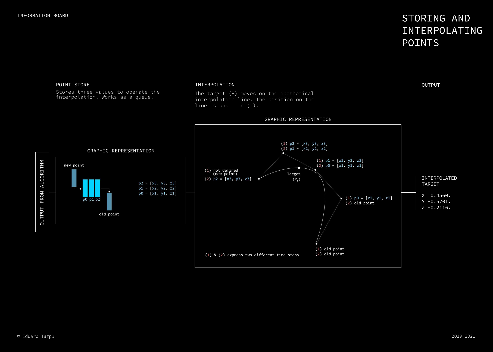

<c>
	COORDINATE FROM FREQUENCY
	</c>

# Introduction

This algorithm wants to realize the translation of a frequency to a (x, y, z) point in space.

For the realization of this system is used as main software [Max/MSP](https://cycling74.com/products/max), inside of which a JavaScript code operates the conversion. 

An example on how this code can be implemented is explained were [here](../README.md/#coordinates-from-sound-signal).

## Inside the process

### Variables

To begin with, the function needs as input from Max/MSP the following variables: (1) the frequency to convert (```sF``` - sound frequency) (2 and 3) the octave range of the instrument that is playing (```oS``` - octave start and ```oF``` - octave finish) and (4) the amplitude (```amp```) of the sound.

Note. The octave range is important to properly represent the frequency in the and space. The system covers all the audible human range, that means that goes from ```C0 16.35Hz``` to ```C10 16744.03Hz``` (with ```A4 440Hz```), but not all the instruments have the same range and to cover the interested dimension in space, a proper setting of the octaves is essential. 

Inside the patch, few are the important variables that are established at the beginning. 

First of all is needed to set a frequency of reference: 

```JavaScript
var a4 = 440; //Hz
```
This is an important implementation, in my opinion, because the evaluation of future notes is based on this value, and it can be adapted to different instrument tunings.

Then, the system computes a set of notes: (1) the frequency of the note ```C``` for each octave and (2) each semitone frequency inside the octave zero.

```JavaScript
const C = [];
var c4;
    
    // C value for the fourth octave

	c4 = a4 * ( Math.pow(2, ( -9 / 12)));

    // C value for all octaves

	for (var i = -4; i < 4; i++) {
		var c = c4 * Math.pow(2, i);
		C.push(c);
	}

    // Semitones inside the octave zero

        var c0 		= 	a4 * ( Math.pow(2, ( -57 / 12)));
	    var c0_sh 	= 	a4 * ( Math.pow(2, ( -56 / 12)));
	    var d0 		= 	a4 * ( Math.pow(2, ( -55 / 12)));
	    var d0_sh	= 	a4 * ( Math.pow(2, ( -54 / 12)));
	    var e0 		= 	a4 * ( Math.pow(2, (- 53 / 12)));
	    var f0 		= 	a4 * ( Math.pow(2, ( -52 / 12)));
	    var f0_sh 	= 	a4 * ( Math.pow(2, ( -51 / 12)));
	    var g0 		= 	a4 * ( Math.pow(2, (- 50 / 12 )));
	    var g0_sh 	= 	a4 * ( Math.pow(2, ( - 49 / 12)));
	    var a0 		= 	a4 * ( Math.pow(2, ( - 48 / 12)));
	    var a0_sh 	= 	a4 * ( Math.pow(2, ( - 47 / 12)));
	    var b0 		= 	a4 * ( Math.pow(2, ( - 46 / 12)));

```
Other variables to keep present of:

```JavaScript
var cubeDim = 5;    // indicates the space dimension of the conversion, represented by a cube
var o;              // will indicate the octave number
var x, y, z;         // will be our result

```

### Function

After this first step, is set up the function:

```JavaScript
function getPoint(sF, oS, oF, amp) {
    ...
}
```
#### Octave identification

After the initialization of the function, is operated a 'find the octave' code. It takes the sound frequency and find to which octave it belongs. Is done by asking if it is contained between the ```C``` values of two near octaves:

```JavaScript
if(sF >= C[0] & sF < C[1]) {
	o = 0;
}
if(sF >= C[1] & sF < C[2]) {
	o = 1;
}
if(sF >= C[2] & sF < C[3]) {
	o = 2;
}

...
// If the frequency exceeds C[10] keep the tenth octave 

if(sF >= C[10]) {
	o = 10;
}

// If the frequency goes below C[0] keep the octave zero

if(sF < C[0]) {
	o = 0;
}

```
### Sound frequency at the octave zero 

Is needed to bring down the sound frequency to the lowest octave, in order to process in a easiest way what will come:

```JavaScript
sF = sF / Math.pow(2, o);
```

To understand how the algorithm proceeds, is useful to consider the three dimensions that describes a cube, in other terms the x, y and z axes. The following steps will consider the dimensions what can be derived from the incoming frequency and transpose them to these three axes. 

One of the first materials, is already been computed: the octave of the note. Consequently, the position of the frequency between the twelve semitones too, can be computed and used to create a dimension that will be mapped to one of the axes. To end with the amplitude coming from the signal from which the frequency is obtained. 

### Between the semitones

In order to evaluate the position of the sound frequency between the semitones is used a method similar to what was seen before to 'find the octave'. However in this case is also evaluated how far from the semitone of belonging the frequency actually is, because it will be relevant at the moment of the interpolation with the axes. 

Three variables are introduced: (1) ```int_line``` that is the number of the semitone in order from  ```C = 0```, to ```B = 11```, (2) ```float_line``` that expresses how far the frequency is from the semitone frequency with a value between 0 and 1, that combined with the first variable that result in the (3) ```line```. 

```JavaScript
var int_line;
var float_line;
var line;

if(sF >= c0 & sF < c0_sh) {
 	float_line = (1 / (c0_sh - c0)) * (sF - c0);
 	int_line = 0;
 	line = int_line + float_line;
}
if(sF >= c0_sh & sF < d0) {
 	float_line = (1 / (d0 - c0_sh)) * (sF - c0_sh);
 	int_line = 1;
 	line = int_line + float_line;
}
if(sF >= d0 & sF < d0_sh) {
 	float_line = (1 / (d0_sh - d0)) * (sF - d0);
 	int_line = 2;
 	line = int_line + float_line;
}

...
```

### To the axes

Is now time to use the materials elaborated until now to achieve the final result. 

To begin, the information about the octave range are now used to evaluate the value for ```oRange``` (octave range). After having computed this value, it is divided by the ```cubeDim```:

```JavaScript
var oRange = oF - oS;
var oPortion = (cubeDim / oRange);
```
The decision regarding on which axis the octave or the semitones should be, is simply related to a personal view of the relation between the y axis with the octaves, related to the idea that major is the octave, higher should be the point in space. Furthermore, the semitones produces a sequence that, viewed also as a musician, works well if interpolated to the x axis of this environment. The last parameter, the amplitude, will drive the position in space on the z axis. 

For the octave we have already evaluated the value that helps us interpolating it to the axes (```oPortion```). The code proceeds to evaluate the same value for the other materials:

```JavaScript
var sPortion = cubeDim / 12; // 12 semitones
var aPortion = cubeDim / 1;  // 1 is the maximum value of an optimal signal

```

Note. Due to the ```jitter``` use of space, the center of the matrix (or the visual space for that instance), will be ```[0, 0, 0]```. To generate a proper visual realization, is needed also the use of the negative values. In this sense the dimension of the cube can not be directly used to achieve the end result, but has to be computed as follow:

```JavaScript
var axes = (cubeDim / 2);
```

And then will follow the final operation that evaluates the interpolation of the values to the assigned axis:

```JavaScript
x = (semitoneSpace * (line)) - axes;
y = (oPortion * (o - oS)) - axes;
z = (aPortion * (amp)) - axes;
```
Then the values can be exported in to the patch: 


```JavaScript
outlet(0, x);
outlet(1, y);
outlet(2, z);
```

or in alternative:

```JavaScript
outlet(0, [x, y, z]);
```

## Interpolation of points

To avoid the coordinates bouncing around the space causing a non homogeneous moving of the particles (if used in this environment), is applied an interpolation between three of the points. 

<p  align="center">

</p>

In order to achieve this, is used a sub-patch inside the Max/MSP environment that allows the temporary storage of three of the points, updating the values at each new ```bang``` received by the ```bonk~``` method inside the pitch tracking method (more can be found [here](../README.md/#coordinates-from-sound-signal)).

The following code allows the interpolation of the points, given as input the three (x, y, z) points and a variable ```tempo```, produced with a ```line``` method, used to move the resulting point on the interpolated line:

```JavaScript

function interp(x1, y1, z1, x2, y2, z2, x3, y3, z3, tempo) {
	  
  var p0 = [x1, y1, z1];
  var p1 = [x2, y2, z2];
  var p2 = [x3, y3, z3];

  bezier = function(t, p0, p1, p2)
  {
  var cX = 3 * (p1[0] - p0[0]);
      bX = 3 * (p2[0] - p1[0]) - cX;

  var cY = 3 * (p1[1] - p0[1]);
      bY = 3 * (p2[1] - p1[1]) - cY;

  var cZ = 3 * (p1[2] - p0[2]);
      bZ = 3 * (p2[2] - p1[2]) - cZ;
      

  var x = (bX * Math.pow(t, 2)) + (cX * Math.pow(t, 1)) + p0[0];
  var y = (bY * Math.pow(t, 2)) + (cY * Math.pow(t, 1)) + p0[1];
  var z = (bZ * Math.pow(t, 2)) + (cZ * Math.pow(t, 1)) + p0[2];
  
  if (isNaN(x) == 1) {
    var x = 0;
  }
  if (isNaN(y) == 1) {
    var y = 0;
  }
  if (isNaN(z) == 1) {
    var z = 0;
  }

  return [x, y, z]; 

  }
    
  var p = bezier(tempo, p0, p1, p2);
  outlet(0, p);

  }
  
```
